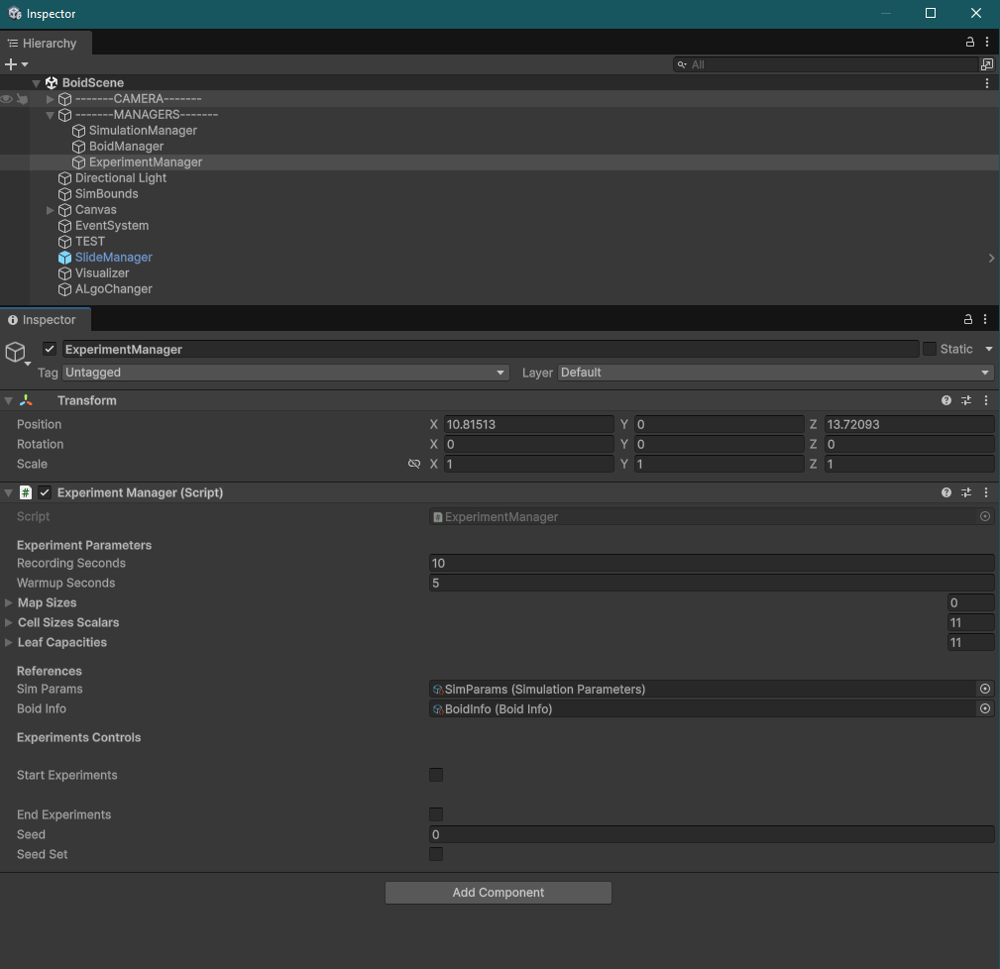

# Boid Simulation: Spatial Partitioning Analysis
**Author:** Dany Diab  
**Student ID:** B00970048  
**Course:** CSCI 4118 - Algorithm Engineering  
**University:** Dalhousie University  

## Project Overview
This project evaluates the performance trade-offs between **Uniform Grids** and **Quadtrees** in varying simulation densities for boid flocking simulations. The core objective is to determine how spatial subdivision parameters (cell size and leaf capacity) respond to changes in agent density. 

## Project Structure
```text
.
├── README.md                               # This file
├── Report.md                               # Final analysis report
├── Report.pdf                              # PDF version of the report
├── Boids/                                  # Unity Project Root
│   ├── Assets/ 
│   │   ├── Graphs/                         # Benchmark visualizations
│   │   ├── Scenes/                         # Unity Scenes
│   │   ├── ScriptableObjects/              # Simulation and Boid configuration assets  
│   │   └── Scripts/    
│   │       ├── SearchAlgos/                # Spatial Partitioning Implementations
│   │       │   ├── UniformGridSearch.cs    # Sorting-based 1D Grid
│   │       ├── Experiments/                # Benchmarking
│   │       │   └── QuadTreeSearch.cs       # Pooled, index-based Quadtree
│   │       ├── Boids/                      # Core flocking logic
│   │       │   ├── Boid.cs                 # Individual agent behavior
│   │       │   └── BoidManager.cs          # Flock management
│   │       │   └── ExperimentManager.cs    # Main experiment runner
│   │       └── Results/                    # Output data
│   │           ├── ExperimentSettings.JSON # Reproducibility parameters
│   │           └── ExperimentResults.csv   # Logged performance metrics
└── images/                                 # Documentation assets
```

## How to Run the Project
While the final report contains all relevant data and analysis, the simulation can be executed or inspected using the instructions below.

### Prerequisites
* **Unity Version:** 6.3 LTS.
* **Build Support:** Windows Standalone.

### Execution Instructions
1.  **Opening the Project:** Open the `Boids` folder as a project in the Unity Hub.
2.  **Scene Setup:** Open `Assets/Scenes/BoidScene.unity`.
3.  **Scriptable Object and Experiment Setup**. Simulation Parameters and boid parameters are controlled with scriptable objects that can be found at `Boids/Assets/ScriptableObjects`. Experiment Related Data can be edited in the Experiment Manager object, as key information is revealed to the editor. 
4.  **Automated Tests:** To regenerate the benchmark data, locate the `ExperimentManager` object in the Hierarchy and check the `Start Experiments` checkbox.

Here is an image showing the ExperimentManager Object in the Inspector and Hierarchy



## References And Acknlodgements:

Kratz, Jakob, and Viktor Luthman. “Comparison of Spatial Partitioning Data Structures in Crowd Simulations.” DIVA, 2021, kth.diva-portal.org/smash/record.jsf?pid=diva2%3A1595833&dswid=2272. Accessed 28 Jan. 2026.

Reynolds, Craig. “Craig Reynolds: Flocks, Herds, and Schools: A Distributed Behavioral Model.” Www.cs.toronto.edu, July 1987, www.cs.toronto.edu/~dt/siggraph97-course/cwr87/.

