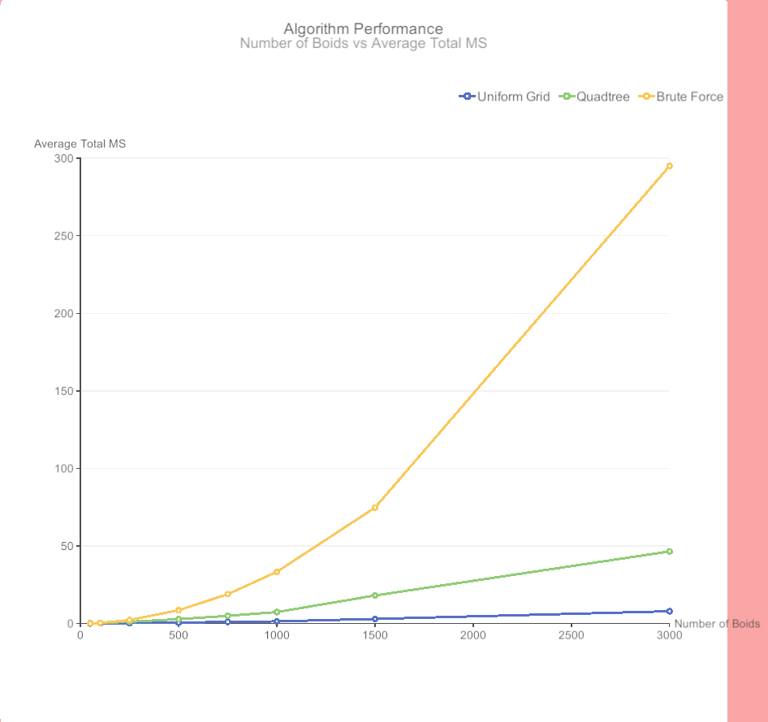
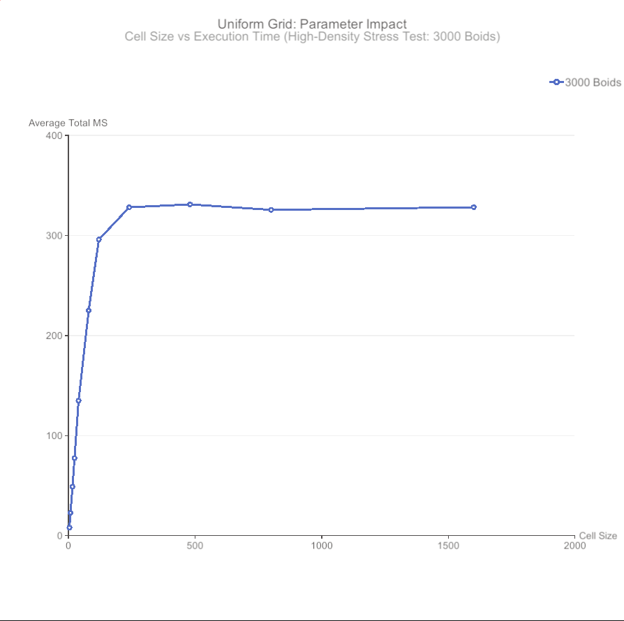
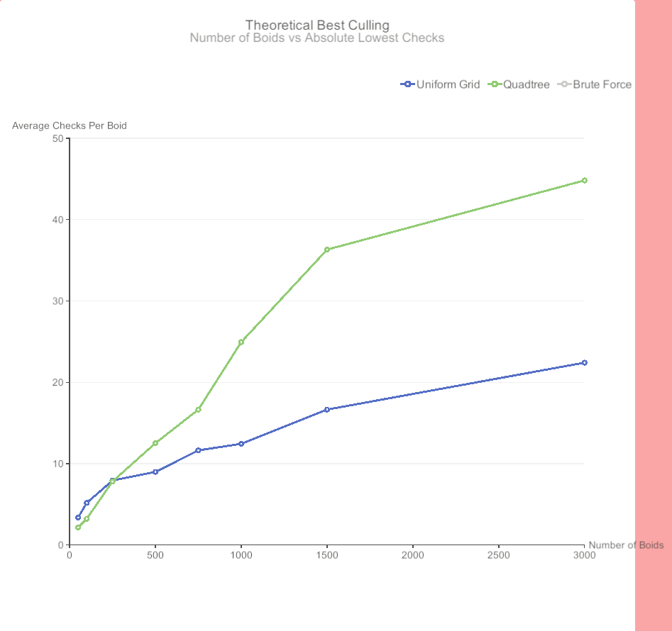

# Spatial Partitioning in Boid Simulations: Analyzing the Impact of Cell Size and Leaf Capacity

## Introduction

In this project, I planned to develop a boid flocking simulation to analyze the impact of cell size and leaf capacity on performance as simulation density increases. To achieve this, I applied several Algorithm Engineering concepts, specifically modeling the spatial proximity problem using different data structures. I designed and implemented two distinct spatial partitioning algorithms: a Uniform Grid and a Quadtree. This ties into my hypothesis which is the following:

### Hypothesis
I theorize that the optimal cell size and leaf capacity for uniform grids and quadtrees respectively is a function of density, which is the average of the number of neighbors per boid.

I theorize that as density increases, the optimal cell size and optimal leaf capacity should decrease. This is to allow for more fine grained search.

Conversely, I also theorize that as density decreases, the optimal cell size and optimal leaf capacity should increase, this is to avoid unnecessary checks and decrease the depth of the quadtree.

Overall I am theorizing that density is a key metric to determining the optimal way to subdivide the space.

Through experimentation, I analyzed how density affected the parameters of these algorithms. The results showed that optimal subdivision is not strictly a function of density. For the quadtree, as density increased, the optimal leaf capacity appeared to increase as well, though non-linearly. Conversely, the uniform grid's optimal cell size was unaffected by density, consistently performing best at precisely half the interaction radius of the boids.

Overall, I successfully completed all planned parts of the project without needing to make any major changes to my original proposal. However, some minor adjustments and additions were made during the development process. For example, I added a fourth force to the boid simulation that pulls boids back toward the center when they leave the designated area. Additionally, I changed my testing methodology: rather than keeping the number of boids static and dynamically changing the map size to control density, I kept the map size static and dynamically changed the number of boids. This adjustment allowed for more precise control over the simulation's overall density and enabled me to represent a wider range of densities in my results.

### Prior Work & Motivation

My work on this project builds upon the research of Kratz and Luthman (2021). In their work, they similarly analyzed the performance of spatial partitioning data structures for boid simulations in Unity. This simulation model is based on a 1987 paper by Craig Reynolds. Kratz and Luthman tested uniform grids, quadtrees, and kd-trees. They concluded that uniform grids and quadtrees performed the best overall. They also found that while the uniform grid was the fastest for a low number of agents, its performance deteriorated faster than the quadtree when the simulation scaled past 5000 agents.

Through their experiments, they highlighted that these algorithms are highly sensitive to agent density. In scenarios where boids clustered together, query times increased significantly across all data structures. The uniform grid struggled with dense clusters because its rigid structure forced it to evaluate massive amounts of boids within a single cell. On the other hand, clustering forced the quadtree to recursively subdivide deeper, which increased the computational cost of updating the tree each frame.

While they established a strong baseline, I observed a gap in their research that I wanted to address. In their limitations, they stated that their structural parameters were chosen arbitrarily. They used a static 100 cells for their grid and a static leaf capacity of 10 for their quadtree. They acknowledged that other values might lead to better performance. This limitation became the core motivation for my project.

Rather than using static numbers, I planned to dynamically test cell sizes and leaf capacities to analyze how they impact performance as density changes. By addressing these variables, I aim to provide key insights into how these algorithms react to different environments. Overall, my goal is to inform future developers on how to make optimal algorithmic choices and tune their data structures for complex simulations.

## Methods

### Data Preparation and Initialization 

In the context of this simulation, the input data consisted of the initial state of the boid agents. For each test run, the map boundary radius was kept static to maintain a constant area. Boids were instantiated with randomized starting positions and initial velocity vectors within these boundaries. Each boid was configured with a standardized three radii, which were for the three different forces that act upon the boids, weights for the three forces, and a maximum speed. To control the simulation density, the number of spawned boids was dynamically scaled across different test iterations rather than altering the map dimensions.

### Experimental Setup and Reproducibility

To ensure the reproducibility of these results, all simulation parameters and initial constants were recorded in a configuration file located at `./Boids/Assets/Scripts/Results/ExperimentSettings.JSON`. This file defines the specific weights for flocking forces, boid radii, and speeds used across all experiments.

The experiments were conducted using the following methodology:

* **Environment:** All tests were executed in a standalone Windows build of the Unity Editor in version 6.3 LTS. The benchmarks were performed on a machine equipped with a Ryzen 5 3600 and 16GB of memory.
* **Testing Loop:** For each density level, the simulation ran for a total of 15 seconds. The first five seconds allow for the simulation to 'warm up' and to allow for boids to cluster. Then the following ten seconds, key metrics were recorded. 
* **Deterministic Initialization:** To ensure that spatial distributions were identical across different algorithm comparisons, a fixed integer seed was applied to the random number generator at the start of every test run. This provides a direct performance comparison by ensuring the "clusters" formed by the boids were identical for both the Uniform Grid and the Quadtree at any given density.

**Note on Execution:** While these experiments rely on the Unity Engine, comprehensive instructions for navigating the project structure, configuring the environment, and executing the automated testing scripts can be found in the `./README.md` file located in the project root.

### Techniques and Implementation

The core simulation relied on the three standard flocking behaviors: alignment, cohesion, and separation. Additionally, a fourth custom boundary force was implemented to gently steer boids back toward the center of the environment if they wandered beyond the designated area, ensuring the boids don't cause out of bounds errors. Despite having the fourth force added, I still ran into this problem, and to combat it, I padded the uniform grid, and quadtree to allow for boids to briefly leave the designated space. 

To optimize the $O(n^2)$ complexity of spatial proximity queries, two spatial partitioning data structures were implemented and evaluated. The first was a Uniform Grid, which maps boid positions into an array, allowing for boids to only have to check neighboring cells for interactions. The second was a standard Quadtree, which recursively subdivided the 2D space into four quadrants whenever a defined leaf capacity was exceeded.

#### Uniform Grid Implementation

The Uniform Grid was implemented using a flattened 1D array approach to optimize for memory cache locality and avoid the overhead of nested collections. The simulation bounds are divided into a grid of uniform squares, where the cell size is calculated to fit the bounds perfectly. 

The implementation follows a specific build and query pipeline every frame:
* **Data Structures:** Instead of a 2D array of lists, the structure relies on an array of `BoidCellPair` structs, which simply hold a `cellID` and a `boidID`. Two additional integer arrays, `cellSizes` and `cellStartOffsets`, are used to track the memory layout.
* **Grid Construction:** At the start of a frame, each boid calculates its `cellID` based on its spatial position. The `cells` array is populated and then sorted by `cellID`. Sorting the array is a crucial algorithm engineering choice; it ensures that boids residing in the same spatial cell are packed contiguously in memory. 
* **Offset Calculation:** After sorting, the algorithm iterates through the array to populate `cellSizes` and `cellStartOffsets`. This allows the grid to know exactly at what index a specific cell's boids begin in the sorted array, and how many boids it contains.
* **Proximity Queries:** When a boid searches for neighbors, it calculates its current `cellID` and determines the IDs of the 9 surrounding cells (including its own). Using the `cellStartOffsets` array, it iterates directly over the contiguous block of memory containing the neighboring boids, performing distance checks $O(k)$ where $k$ is the number of boids in the adjacent cells.

#### Quad Tree Implementation

The Quad Tree recursively subdivides the 2D spatial environment into four quadrants whenever a specific `leafCapacity` is exceeded. To minimize the significant garbage collection overhead typical of standard tree structures in Unity, the tree was implemented using a memory-pooled, index-based node list.

* **Data Structures:** The tree is stored in a flat `List<Node>`. Each `Node` is a struct containing a `List<int>` of boid IDs and a `firstChild` integer index. If `firstChild` is `-1`, the node is a leaf; otherwise, it points to the starting index of its four contiguous children in the list.
* **Object Pooling:** To prevent allocating and deallocating memory every frame, a `nodePool` array is initialized at startup. When the tree is rebuilt each frame, old nodes are returned to the pool and cleared. When a leaf needs to split, it retrieves four recycled nodes from the pool rather than calling the constructor, drastically reducing GC spikes.
* **Tree Construction:** The tree is rebuilt from scratch every frame. All nodes are returned to the pool, and a root node is created. Each boid is inserted by traversing the tree based on its spatial position. If a boid is added to a leaf and pushes the count past the `leafCapacity`, the node splits, allocates four children from the pool, and redistributes its boids into the new sub-quadrants.
* **Proximity Queries:** When searching for neighbors, a recursive boundary check is performed. The algorithm tests if the boid's interaction radius intersects with the bounding box of the current node. If it does not intersect, the entire branch is discarded. If it does intersect and the node is a leaf, the boids within that leaf are evaluated for exact distance checks.

### Data Analysis

To analyze the impact of the data structures on performance, I conducted a parameter sweep across various density levels. For the Uniform Grid, the cell size was systematically varied to observe the effect on computation time. For the Quadtree, the maximum leaf capacity was varied. Performance was analyzed quantitatively using the C# `System.Diagnostics.Stopwatch` class to record the precise execution time of the spatial partitioning algorithms per frame. Additionally, I tracked the total number of agent-to-agent distance checks performed by the boids using a simple increment counter, providing a secondary, hardware-independent metric of computational efficiency. It is important to note that for the Quadtree, this metric strictly isolates the interactions between boids and does not include the boundary intersection checks required to traverse the tree structure. By plotting these execution times and local distance check counts against the changing simulation densities, I was able to identify the optimal cell size for the grid and the optimal leaf capacity for the tree at different density levels.

## Results

My initial hypothesis was that the optimal subdivision for both algorithms would act as a function of the simulation's density. However, the results showed that this was incorrect. Across all the different densities I tested, the uniform grid consistently executed faster than the quadtree. 

### Uniform Grid Analysis

For the uniform grid, the optimal cell size was unaffected by density. Instead, it was always precisely half of the boids' interaction radius (which is the maximum of the three radii acting on the boids). Regardless of how much the density increased, keeping this static cell size yielded the best performance.

As shown in the parameter impact stress test above, the uniform grid does not suffer from a computational time trade-off as cell size decreases. Instead, execution time strictly improves until it hits the hardcoded mathematical floor of the 3x3 search area. Because the algorithm is built to query only a boid's current cell and its 8 immediate neighbors, shrinking the cell size any further would mean this 9-cell search area no longer fully covers the boid's maximum interaction radius. This would cause the simulation to drop valid neighbors and break flocking behaviors. This demonstrates that the grid's parameter tuning is highly predictable under high densities, finding its optimal state at the absolute tightest spatial subdivision the algorithm can support without compromising correctness. 

However, it is important to acknowledge that this CPU optimization comes with an inherent memory trade-off. As the cell size shrinks, the total number of cells required to cover the map increases quadratically, requiring larger array allocations. While my data collection methodology strictly isolated execution time (MS) and did not track specific memory consumption metrics to provide exact byte counts, the theoretical cost remains clear: achieving the absolute fastest query times with the uniform grid requires sacrificing a larger memory footprint to store the finer spatial subdivisions.

### QuadTree Analysis

On the other hand, the quadtree's optimal leaf capacity was affected by density, though the relationship was not linear. While the optimal leaf capacity generally increased as the simulation became denser, there were significant fluctuations in the data. 

These fluctuations can be attributed to the inherent computational trade-offs of the Quadtree structure. The efficiency of the tree is a balancing act between two distinct competing costs:

* **Traversal Time:** Increasing the leaf capacity results in a shallower tree. A shallower tree requires fewer recursive subdivisions, making it computationally cheaper to traverse.
* **Distance Checks:** However, a higher leaf capacity means more boids occupy a single leaf. Because boids within the same leaf must check distances against one another, this increases the local computational load.

Conversely, decreasing the leaf capacity reduces the number of distance checks per leaf but creates a deeper, denser tree that requires more CPU cycles to traverse. 

Unlike the predictable scaling of the uniform grid, the quadtree is highly sensitive to parameter tuning. The stress test above reveals a U-shaped performance penalty. If the capacity is too high, the simulation bogs down in local distance checks; if it is too low, the CPU is overwhelmed by the traversal overhead of a deep tree, resulting in an idle CPU as it awaits memory allocation from the heap.

Even though I didn't record the exact time difference between rebuilding the tree and traversing it, the performance graphs strongly point to traversal as the main bottleneck. Looking at the Algorithm Performance graph, the quadtree's execution time is practically zero at low densities (under 500 boids). This shows that the baseline cost of clearing and rebuilding the memory-pooled tree every frame is very small. 

However, as the density increases, the execution time scales non-linearly. Because inserting boids into a pre-allocated tree generally scales at $O(n \log n)$, this massive spike in time doesn't match the cost of just rebuilding the structure. Instead, it reflects the huge increase in mathematical boundary checks needed to traverse the tree when boids are clustered closely together. By looking at the minimal baseline rebuild cost alongside the low number of agent-to-agent distance checks, it becomes clear that navigating the tree's bounds is the real performance bottleneck, rather than reconstructing the tree itself.

### Theoretical Culling Limits

To push the analysis further, I isolated the data to determine which data structure is mathematically capable of the tightest spatial culling, regardless of execution time. The graph below plots the absolute lowest number of distance checks each algorithm can achieve at various densities. 

This theoretical limit reveals a distinct density threshold at approximately 250 boids. Below this threshold, the simulation is sparse. The quadtree is highly efficient at discarding massive quadrants of empty space, allowing isolated boids to perform fewer checks than the uniform grid's rigid 9-cell query. 

However, as the density surpasses 250 boids, the uniform grid overtakes the quadtree. In dense clusters, the quadtree's fixed spatial boundaries become a liability. Boids near the edge of a quadrant must query adjacent leaves, resulting in false-positive checks against boids on the far side of those neighboring partitions. The uniform grid completely avoids this "boundary spillover" penalty because its perfectly scaled 9-cell search effectively generates a custom, localized bounding box tightly centered around the querying boid, making it mathematically superior at culling high-density environments.

## Conclusion and Future Work

Overall, the results of this experiment demonstrate how these spatial partitioning algorithms perform in a dense boid simulation. My initial hypothesis was that the optimal subdivision parameters would be directly correlated with the simulation density. However, my results showed that this was incorrect. The uniform grid's optimal cell size was tied to the maximum interaction radius rather than the density. On the other hand, the quadtree experienced non-linear fluctuations because of the computational tradeoff between traversal depth and local distance checks.

These findings build on the prior research conducted by Luthman and Krats. Their work established that both data structures perform well in Unity. However, they used static cell sizes and leaf capacities, which leaves a gap in understanding how these structures react to different environments. By dynamically testing these parameters across different densities, this project shows that the uniform grid is unaffected by density changes. It also shows that developers need to carefully tune quadtree capacities to avoid performance issues.

While the uniform grid consistently outperformed the quadtree in my tests, there were limitations to my implementations. My uniform grid was highly optimized using a flattened 1D array approach. This improves performance significantly through better memory cache locality. In contrast, the quadtree used a standard implementation. A primary area for future work would be implementing a quadtree using a 1D array approach. I theorize that if the quadtree were optimized to the same level as the grid, its performance could be comparable to or even better than the uniform grid.

Another limitation is that my testing was restricted to isolating the impact of density. I did this by scaling the number of boids within a static map. Future research could expand this to test other parameters. For example, the boids in my simulation had a full 360 degree field of view. Testing a restricted field of view, which is more realistic to a real flock, would change the number of required interactions and could alter the results. Additionally, future experiments could explore changing the maximum interaction radii or adjusting the weights of the alignment, cohesion, and separation forces. Testing these extra parameters would provide more insights to help developers make algorithmic choices in complex simulations.

A notable limitation in my data collection was the isolation of the boid-to-boid distance checks rather than total number of distance checks. While the uniform grid and brute force approaches only have boid-to-boid distance checks, the quadtree uses distance checks between quadrants and boids to cull the space. As a result this distance check metric does not fully represent the quadtree's total overhead. However it is still noteworthy to view this metric because in doing so, we can see the severity of the quadtree's traversal cost. When comparing the low distance checks against the higher overall execution time, it becomes clear that traversing the tree becomes a significant factor towards performance. Future iterations of this experiment should implement two counters. One counter should counter the number of boid-to-boid distance checks, and a counter for quadrant intersection distance checks, in doing so, this will allow for a complete algorithmic profile.

## References And Acknowledgements:

Kratz, Jakob, and Viktor Luthman. “Comparison of Spatial Partitioning Data Structures in Crowd Simulations.” DIVA, 2021, kth.diva-portal.org/smash/record.jsf?pid=diva2%3A1595833&dswid=2272. Accessed 28 Jan. 2026.

Reynolds, Craig. “Craig Reynolds: Flocks, Herds, and Schools: A Distributed Behavioral Model.” Www.cs.toronto.edu, July 1987, www.cs.toronto.edu/~dt/siggraph97-course/cwr87/.

This project was developed as part of the CSCI 4118 curriculum at Dalhousie University. I would like to thank Professor Christopher Whidden for guidance, and for this amazing course and course project!